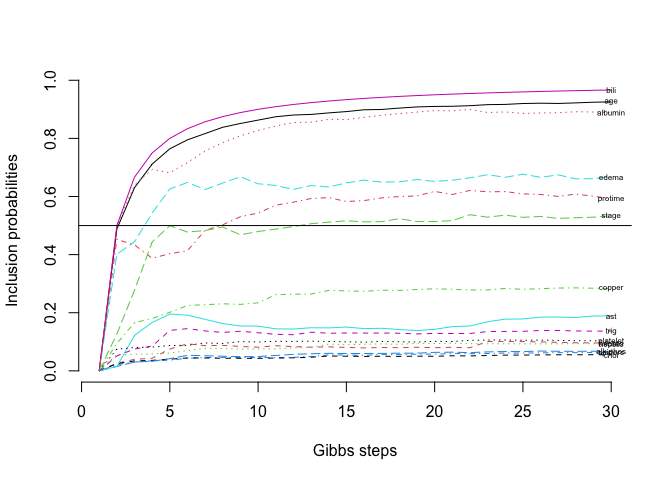

# Model uncertainty quantification in Cox regression

This implements the Bayesian model selection for Cox-Model using
conventional priors. Data and example run after necessary functions.

## Library of functions

These functions are used for calculating model posterior probabilities
and inclusion probabilities.

First install and load necessary libraries

    rm(list=ls())

    # install.packages("LearnBayes")
    # install.packages("plyr")
    # install.packages("numDeriv")
    # install.packages("doParallel")
    # install.packages("doSNOW")

    library(survival)
    library(compiler)
    library(LearnBayes)
    library(plyr)
    library(numDeriv)
    library(doParallel)

    ## Loading required package: foreach

    ## Loading required package: iterators

    ## Loading required package: parallel

    library(doSNOW)

    ## Loading required package: snow

    ## 
    ## Attaching package: 'snow'

    ## The following objects are masked from 'package:parallel':
    ## 
    ##     clusterApply, clusterApplyLB, clusterCall, clusterEvalQ,
    ##     clusterExport, clusterMap, clusterSplit, makeCluster, parApply,
    ##     parCapply, parLapply, parRapply, parSapply, splitIndices,
    ##     stopCluster

## Set of Functions

Here is the custom set of functions.

    # Analytic gradient of prior
    grad.anal.c=function(betas,Z,delta,vari,variinv,p,n){
      tX=t(Z)
      eta=exp(Z%*%betas)
      Xk=array(NA,dim=c(p,n))
      for(i in 1:(n-1)){
          psi.ki=sum(eta[i:n])
          Xk[,i]=(tX[,i:n]%*%eta[i:n]/psi.ki)
      }
      Xk[,n]=tX[,n]

      grad=(Xk-t(Z))%*%delta
      # Prior Gradient
      #
      grad=grad+variinv%*%betas  #The last term is the gradient of the prior

      return(c(grad))
    }

    grad.anal=cmpfun(grad.anal.c)

    ## Calculate the model indices based on only additive effects of the covariates
    index.models=function(numvar,onlyone=FALSE){  
      indici = seq(1,numvar)
      ind.betas = NULL
      for(j in 1:(numvar*(1-onlyone)+1*(onlyone))){
        comb.beta = combn(indici, j)
        for(i in 1:dim(comb.beta)[2]) ind.betas=c(ind.betas,list(comb.beta[,i]))
      }
      return(ind.betas)
    }

    H.0.esti=function(t,hazard.cum,time){
      hazard.cum=c(0,hazard.cum)
      time=c(0,time)
      return(hazard.cum[findInterval(t,time,left.open=TRUE)])
    }

    #Logdensity robust prior:
    lpi.g=function(g,n,k.gamma){
      if(g> (1+n)/(n*(k.gamma+1))-1/n) val.lpi=log(0.5)+0.5*(log(1+n)-log(k.gamma+1)-log(n))-3/2*log(g+1/n)
      else val.lpi=-Inf
      return(val.lpi)
    }

    #Marginal modelo nullo usando likelihood parcial:
    l.margi0.parcial=function(delta){
      n=length(delta)
      n.i=n:1
      Bs=1/n.i
      aux=sum(delta*log(Bs))
      return(aux)
    }

    calc.W.wei=function(censtime,alpha0,beta0){
      n=length(censtime)
      H0=exp(beta0)*censtime^alpha0
      W=diag(1-exp(-H0)+exp(-H0)*H0,nrow=n,ncol=n)
      Uno=matrix(1,nrow=n,ncol=1)
      #Usamos la otra definicion de Weig:
      neff=sum(diag(W))
      Weig=W-W%*%(Uno%*%t(Uno)/neff)%*%W
      return(list(Weig=Weig,neff=neff))
    }

    # Partial Log-likelihood  
    lp.like.u=function(beta,Z,delta,n){
      eta=Z%*%beta
      e.eta=exp(eta)
      termi=eta-log(cumsum(e.eta[n:1])[n:1])
      aux=delta%*%termi
      return(aux)
    }

    #Log-robust-prior as function of de g y de beta:
    lprior.u.robust=function(beta,n,SigmaM){
      k.gamma=length(beta)
      fii=function(g) exp(dmnorm(x=beta,mean=0,varcov=g*SigmaM,log=TRUE)+lpi.g(g,n,k.gamma=k.gamma))
      fi=function(g) mapply(fii,g)
      lprior=log(integrate(fi,lower=(1+n)/(n*(k.gamma+1))-1/n,upper=Inf)$value)
      return(lprior)
    }

    #Log posterior with robust prior
    lpost.u.robust=function(g,beta,Z,delta,SigmaM,n,p){
      #Xt.Weig.X=t(Z)%*%Weig.matrix%*%Z
      #vari=ne*solve(Xt.Weig.X)
      V=g*SigmaM
      return(lp.like.u(beta,Z,delta,n=n)+dmnorm(x=beta,mean=0,
                                            varcov=V,log=TRUE)+lpi.g(g,n,k.gamma=p))
    }

    post.lp.robust.tointe.aux=function(g,beta,Z,delta,SigmaM,k.star=NULL,n,p){exp(lpost.u.robust(g=g,beta=beta,Z=Z,delta=delta,SigmaM=SigmaM,n=n,p=p)+k.star)}
    post.lp.robust.tointe=function(g,beta,Z,delta,SigmaM,k.star=NULL,n,p){ mapply(post.lp.robust.tointe.aux,g,MoreArgs=list(beta=beta,Z=Z,delta=delta,SigmaM=SigmaM,k.star=k.star,n=n,p=p))}

    #Log Posterior distribution: we integrate g with respecto to the g-prior
    lp.u.robust.g.inte=function(beta,Z,delta,SigmaM,k.star=NULL,n,p){
      tmp=integrate(post.lp.robust.tointe,lower=(1+n)/(n*(p+1))-1/n,
                    upper=Inf,beta=beta,Z=Z,delta=delta,SigmaM=SigmaM,k.star=k.star,n=n,p=p)
      return(log(tmp$value))
    }

    #The function to optimize when using the normal as prior over beta:
    h.parci.SigmaM.normal=function(betas,Z,delta,vari,variinv=NULL,p=NULL,n){
      return(-lp.like.u(betas,Z,delta,n=n)-dmnorm(betas,varcov=vari,log=TRUE))
    }

    # Log marginal with robust prior
    lmarg1.laplace.SigmaM.robust=function(y,rel,X,censtime,Weig.matrix,ne,k.star,use.cox=TRUE){
      X=as.matrix(X)
      p=ncol(X)
      n=nrow(X)
      Xt.Weig.X=t(X)%*%Weig.matrix%*%X
      SigmaM.hat=ne*solve(Xt.Weig.X)
      
      if(p==1) {
        if(use.cox){
          res.cox <- coxph(Surv(y,rel) ~ X)
          desvi.coef=sqrt(res.cox$var)
        }else{ res.cox$coef=0
        desvi.coef=1
        }
        tt1=optim(par=res.cox$coef,fn=lp.u.robust.g.inte,Z=X,delta=rel,
                  SigmaM=SigmaM.hat,k.star=k.star,n=n,p=p,hessian=TRUE,method="Brent",lower=res.cox$coef-4*desvi.coef, upper = res.cox$coef+4*desvi.coef,control=list(fnscale=-1))
        hessi=-tt1$hessian
        map.coef=as.vector(tt1$par)
      }
      else{
        tt.cox=coxph(Surv(y,rel) ~ X)
        parms.hat1=tt.cox$coefficients
        tt1=optim(par=parms.hat1,fn=lp.u.robust.g.inte,Z=X,delta=rel,
                  SigmaM=SigmaM.hat,k.star=k.star,n=n,p=p,hessian=FALSE,method="Nelder-Mead",control=list(fnscale=-1))

        hessi.lk=-hessian(lp.like.u,x=tt1$par,Z=X,delta=rel,n=n)
    #    hessi.lk=info.matrix2(beta=tt1$par,Z = X,n = n,nobs = nobs,p = p,Unos = Unos) ## Esto de optimizar
        hessi.prior=-hessian(lprior.u.robust,x =tt1$par,n=n,SigmaM=SigmaM.hat)
        hessi=hessi.lk+hessi.prior
        
        map.coef=as.vector(tt1$par)
      }
      lm1.lapl=lp.u.robust.g.inte(map.coef,Z=X,delta=rel,
                                  SigmaM=SigmaM.hat,k.star=k.star,n=n,p=p)+p/2*log(2*pi)-0.5*log(det(hessi))
      return(list(lm1=lm1.lapl,betas=map.coef))
    }

    # Marginal distribution when the normal prior distribution for beta is used, that is g=1
    lmarg1.laplace.SigmaM.normal=function(y,rel,X,censtime,Weig.matrix,ne,k.star,use.cox=TRUE){
      X=as.matrix(X)
      p=ncol(X)
      n=nrow(X)
      Xt.Weig.X=t(X)%*%Weig.matrix%*%X
      SigmaM.hat=ne*solve(Xt.Weig.X)
      #Hessiano de la log prior, es -Xt.Weig.X/ne, cambiamos de signo porque necesitamos el hessiano de la -log prior:
      hessi.prior=Xt.Weig.X/ne
      
      if(p==1) {
        if(use.cox){
          res.cox <- coxph(Surv(y,rel) ~ X)
          desvi.coef=sqrt(res.cox$var)
        }else{ res.cox$coef=0
        desvi.coef=1}
        tmp=optimize(h.parci.SigmaM.normal,interval=c(res.cox$coef-4*desvi.coef,res.cox$coef+4*desvi.coef),Z=X,delta=rel,
                     vari=SigmaM.hat,p=p,n=n)
        map.coef=tmp$minimum
      }

      tt.cox=coxph(Surv(y,rel) ~ X)
      parms.hat1=tt.cox$coefficients
      tt1=optim(par=parms.hat1,fn=h.parci.SigmaM.normal,
                gr = grad.anal,
                Z=X,delta=rel,
                vari=SigmaM.hat,variinv=hessi.prior,p=p,n=n,hessian=FALSE,method="BFGS")

      #hessi=tt1$hessian
      #Hessian of the likelihood:
      hessi.lk=-hessian(lp.like.u,x=tt1$par,Z=X,delta=rel,n=n)

      #Hessian of the likelihood:
      # hessi.lk=hessi.anal(tt1$par,X,n,p,delta=rel)
      
      hessi=hessi.lk+hessi.prior
      lm1.lapl=lp.like.u(tt1$par,Z=X,delta=rel,n=n)+dmnorm(tt1$par,varcov=SigmaM.hat,log=TRUE)+p/2*log(2*pi)-0.5*log(det(hessi))
      return(list(lm1=lm1.lapl,betas=tt1$par))
    }

    # Model posterior with Scott-Berger prior on models
    prob.post=function(BF,mod.list,scott=TRUE){
      nmodels=length(mod.list)
      prob.post=rep(NA,nmodels+1)
      BF=c(1,BF)
      if(scott==FALSE){
        for(i in 1:(nmodels+1)){
          prob.post[i]=(1+sum(BF[-i]/BF[i]))^(-1)
        }
      }else{
        ncov=c(0,laply(mod.list,length))
        uncov=unique(ncov)
        p=max(ncov)
        redprior=1/(p+1)
        redprior=redprior/c(table(ncov))
         modprior=redprior[ncov+1]
        for(i in 1:(nmodels+1)){
          prob.post[i]=(1+sum(modprior[-i]*BF[-i]/(modprior[i]*BF[i])))^(-1)
        }
      }
      return(prob.post)
    }

    # Evaluate all models
    cBvs=function(dat=dat,nclust=4,mat.full.model=NULL,use.posterior,k.star=NULL){
      
      use.posterior=get(use.posterior)
      
      delta=cbind(dat$delta)
      time=dat$time
      censtime=dat$censtime
      
      
      if(is.null(mat.full.model)){
        X.full=dat[,!colnames(dat)%in%c("delta","time","censtime")]}else{
          X.full=dat[mat.full.model]}
      n=nrow(X.full)
      p=ncol(X.full)
      Uno=matrix(1,nrow=n,ncol=1)
      Id=diag(1,n)
      X.full=as.matrix(X.full)
      X.full=(Id-Uno%*%t(Uno)/n)%*%X.full

      # Cumulative Hazard estimation under the null
      res.cox0=coxph(Surv(time,delta) ~ 1)
      hazard.cum <- basehaz(res.cox0)
      hazard.cum=hazard.cum[match(time, hazard.cum[, "time"]), "hazard"]
      
      
      # W matrix
      H.0.i=H.0.esti(censtime,hazard.cum,time)
      S.u=diag(exp(-H.0.i),nrow=n)
      D.u=diag(exp(-H.0.i)*H.0.i,nrow=n)
      W=(Id-S.u+D.u)
      # Scaling
      neff.cox=sum(diag(W))
      # Weights for Cox - model
      W.cox=W-W%*%(Uno%*%t(Uno)/neff.cox)%*%W
      
      # Marginal for the null
      lm0.parci=l.margi0.parcial(delta)
      if(is.null(k.star)) k.star=-lm0.parci+10
      
      # List of models
      mod.list=index.models(ncol(X.full))
      nmodels=length(mod.list)
     
      # Parallel evaluation:
      cl <- makePSOCKcluster(nclust)
      registerDoParallel(cl)
      all.lm1.laplace<- foreach(i=1:nmodels, .combine=c) %dopar% {
        source("library-bfcensored-cox.R")
        xx=use.posterior(y=time,rel=c(delta),
                                        X=X.full[,mod.list[[i]]],censtime=censtime,
                                        Weig.matrix=W.cox,ne=neff.cox,k.star=k.star)
        return(xx$lm1)
      }
      stopCluster(cl)
      
      
      BF.all=exp(all.lm1.laplace-k.star-lm0.parci)
      
      # Model posterior probabilities
      Prob.post=prob.post(BF.all,mod.list,scott=TRUE)

      # Inclusion probabilities
      results<- matrix(0, ncol=ncol(X.full)+4, nrow=nmodels+1)
      colnames(results)<- c(colnames(X.full), "lmarg", "BF", "PriorProb", "PosteriorProb")
      for (i in 1:nmodels){
        results[i,mod.list[[i]]]<- 1
        results[i,ncol(X.full)+1:2]<- c(all.lm1.laplace[i], BF.all[i])
        results[i,ncol(X.full)+3]<- exp(-log(p+1)-lchoose(p,length(mod.list[[i]]))) 
      }
      results[nmodels+1,ncol(X.full)+1:3]<- c(lm0.parci, 1, 1/(p+1))
      results[,"PosteriorProb"]<- results[,"PriorProb"]*results[,"BF"]/sum(results[,"PriorProb"]*results[,"BF"])
      
      hpm<- which(results[,"PosteriorProb"]==max(results[,"PosteriorProb"]))
      hpm=results[hpm,]
      inc.prob=colSums(results[,1:ncol(X.full)]*results[,"PosteriorProb"])
      return(list(complete=results,hpm=hpm,inc.prob=inc.prob))
    }

    # Gibbs models exploration for our method
    cGibbsBvs=function(dat=dat,mat.full.model=NULL,
                       model.ini=NULL,d.ini=NULL,N=500,burn.in=50,iseed=17,
                       use.posterior,k.star=NULL,verbose=FALSE){
      
      use.posterior=get(use.posterior)
      
      
      delta=dat[,colnames(dat)=="delta"]
      time=dat[,colnames(dat)=="time"]
      censtime=dat[,colnames(dat)=="censtime"]
      
      
      
      if(is.null(mat.full.model)){
        X.full=dat[,!colnames(dat)%in%c("delta","time","censtime")]}else{
          X.full=dat[mat.full.model]}
      n=nrow(X.full)
      p=ncol(X.full)
      Uno=matrix(1,nrow=n,ncol=1)
      Id=diag(1,n)
      X.full=as.matrix(X.full)
      #Centramos la matriz X.full:
      X.full=(Id-Uno%*%t(Uno)/n)%*%X.full
      
      
      # Cumulative Hazard estimation under the null
      res.cox0=coxph(Surv(time,delta) ~ 1)
      hazard.cum <- basehaz(res.cox0)
      hazard.cum=hazard.cum[match(time, hazard.cum[, "time"]), "hazard"]
      
      # Weights calculus
      H.0.i=H.0.esti(dat$censtime,hazard.cum,time)
      S.u=diag(exp(-H.0.i),nrow=n)
      D.u=diag(exp(-H.0.i)*H.0.i,nrow=n)
      W=(Id-S.u+D.u)
      neff.cox=sum(diag(W))
      W.cox=W-W%*%(Uno%*%t(Uno)/neff.cox)%*%W
      
      # Marginal under the null
      lm0.parci=l.margi0.parcial(delta)
      if(is.null(k.star)) k.star=-lm0.parci+10
      
      #null model
      modelsB.PM<- array(rep(0, p+1),dim = c(1,p+1)) #the last column contains BF_a0*Pr(M)
      modelsB.PM[1,p+1]<- 1 #B.PM(rep(0,p)) Null vs Null
      
      #set.seed(iseed)
      if(is.null(model.ini)){
        if(is.null(d.ini)) d.ini=round(p/2)
        model.ini<- sample(c(rep(1, d.ini), rep(0, p-d.ini)))
      }
      current.model=model.ini
      
      aux<-use.posterior(y=time,rel=c(delta),
                         X=X.full[,current.model==1],
                         censtime=censtime,
                         Weig.matrix=W.cox,ne=neff.cox,
                         k.star=k.star)
      #B.PM contains Bayes Factor multiplied by prior distribution:
      B.PMcurrent<- exp(aux$lm1-k.star-lm0.parci-lchoose(p, sum(current.model)))
      
      proposal.model<- current.model
      #matrix of unique models and BFxP(M) 
      modelsB.PM<- rbind(modelsB.PM, c(current.model, B.PMcurrent))
      

      visitedmodels.PM<- modelsB.PM
      #Rao-Blackwellized inclusion probabilities:
      incl.probRB<- array(0,dim=c(N+burn.in,p))
      for (i in 1:(N+burn.in)){
        if(verbose) cat("It:",i,"\n")
        for (j in 1:p){
          proposal.model<- current.model
          proposal.model[j]<- 1-current.model[j]
          #check if it is in your list
          jj=nrow(modelsB.PM)+1
          coincidence=FALSE
          while((!coincidence)&(jj>1)){
            jj=jj-1
            coincidence=all(modelsB.PM[jj,1:p]==proposal.model)
          }
          #cat("coincident", coincident, "\n")
          if(!coincidence) {
            aux<-use.posterior(y=time,rel=c(delta),
                               X=X.full[,proposal.model==1],
                               censtime=censtime,
                               Weig.matrix=W.cox,ne=neff.cox,
                               k.star=k.star)
            B.PMproposal<-exp(aux$lm1-k.star-lm0.parci-lchoose(p, sum(proposal.model)))
            modelsB.PM<- rbind(modelsB.PM, 
                               c(proposal.model, B.PMproposal))
          }else{
            B.PMproposal<- modelsB.PM[jj, p+1]
          }
          
          #B.PMproposal<- B.PM(proposal.model)
          ratio<- B.PMproposal/(B.PMproposal+B.PMcurrent)
          #cat("ratio", ratio, "\n")
          if (runif(1)<ratio){
            current.model[j]<- proposal.model[j]
            B.PMcurrent<- B.PMproposal
          }
          if(i>1){
            incl.probRB[i,j]<-incl.probRB[i-1,j]+proposal.model[j]*ratio+(1-proposal.model[j])*(1-ratio)
            #incl.probRB[i,j]<-incl.probRB[i,j]         
          } 
        }
        visitedmodels.PM<- rbind(visitedmodels.PM, c(current.model, B.PMcurrent))
      }
      
      for(j in 1:p) incl.probRB[,j]<-incl.probRB[,j]/seq(1,(N+burn.in))
      
      visitedmodels.PM=visitedmodels.PM[-(1:(burn.in+2)),]
      
      inc.prob=colMeans(visitedmodels.PM[,-(p+1)])
      names(inc.prob)=colnames(X.full)
      
      xx=unique(visitedmodels.PM)
      xx[,p+1]=xx[,p+1]/sum(xx[,p+1])
      xx=xx[order(xx[,p+1],decreasing = TRUE),]
      colnames(xx)=c(colnames(X.full),"pp")
      hpm=xx[1,]
      if(sum(hpm[1:p])>0){
        aux<-use.posterior(y=time,rel=c(delta),
                           X=X.full[,hpm[1:p]==1],
                           censtime=censtime,
                           Weig.matrix=W.cox,ne=neff.cox,
                           k.star=k.star)
        betas.hpm=aux$betas
        names(betas.hpm)=colnames(X.full)[hpm[1:p]==1]
      }else{
        hpm="Null"
        betas.hpm=NULL
      }
      if(any(incl.probRB[N,]>0.5)){
        mpm=colnames(X.full)[incl.probRB[N,]>0.5]
        aux<-use.posterior(y=time,rel=c(delta),
                           X=X.full[,incl.probRB[N,]>0.5],
                           censtime=censtime,
                           Weig.matrix=W.cox,ne=neff.cox,
                           k.star=k.star)
        betas.mpm=aux$betas
        names(betas.mpm)=mpm
      }else{
        mpm="Null"
        betas.mpm=NULL}
      return(list(complete=visitedmodels.PM,hpm=hpm,mpm=mpm,
                  betas.hpm=betas.hpm,betas.mpm=betas.mpm,
                  inc.prob=inc.prob,prob.post=xx,incl.probRB=incl.probRB))
    }

## Data anaylisis of PBC dataset

    pbc2=pbc[1:312,] # Most complete obs
    pbc2=pbc2[,-1] # Delete Id
    # Some imputation of missing data
    pbc2$copper[is.na(pbc2$copper)]=median(pbc2$copper,na.rm=TRUE)
    pbc2$chol[is.na(pbc2$chol)]=median(pbc2$chol,na.rm=TRUE)
    pbc2$trig[is.na(pbc2$trig)]=median(pbc2$trig,na.rm=TRUE)
    pbc2$platelet[is.na(pbc2$platelet)]=median(pbc2$platelet,na.rm=TRUE)
    # Definition of status variable
    pbc2$status[pbc2$status==0 | pbc2$status==1]=0
    pbc2$status[pbc2$status==2]=1
    #Transformation like in original work:
    pbc2$bili=log(pbc2$bili)
    pbc2$albumin=log(pbc2$albumin)
    pbc2$protime=log(pbc2$protime)
    # No factors are allowed 
    X=as.matrix(pbc2[,-c(1,2,3,5)])
    X=apply(X,2,scale)
    cens=pbc2$time
    cens[pbc2$status==1]=cens[pbc2$status==1]+runif(sum(pbc2$status==1),20,365*1)

    dat=data.frame(X,pbc2$time,pbc2$status,cens)
    p=dim(X)[2]

    #In our functions we need to order the data.frame according with the ys values:
    dat=dat[order(pbc2$time),]
    names(dat)[p+1]="time"
    names(dat)[p+2]="delta"
    names(dat)[p+3]="censtime"

    res.bvs.gibbs<-
      cGibbsBvs(dat=dat, # Data set Matrix form
                N=20, # Total number of simulations
                burn.in=10, # plus burnin
                use.posterior="lmarg1.laplace.SigmaM.normal", # Which prior to use
                k.star=0, # Internal for numerical stability
                d.ini=4, # Initial model dimension in Gibbs sampling
                verbose=FALSE # Messages from functions
                )

    # What is in the Median probability model
    res.bvs.gibbs$mpm

    ## [1] "age"     "edema"   "bili"    "albumin" "protime" "stage"

    colnames(res.bvs.gibbs$incl.probR)=colnames(X)
    matplot(res.bvs.gibbs$incl.probR,type="l",bty="n",
            ylab="Inclusion probabilities",xlab="Gibbs steps")
    text(x = nrow(res.bvs.gibbs$incl.probR),
         y=res.bvs.gibbs$incl.probR[nrow(res.bvs.gibbs$incl.probR),],
         colnames(X),cex=0.5)
    abline(h=0.5)

